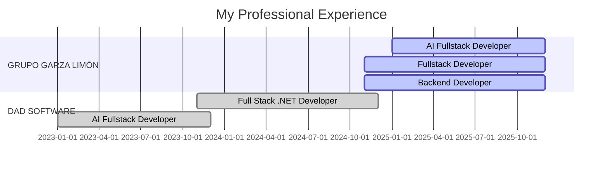

<div align="center">

<!-- EPIC ANIMATED BANNER -->


<!-- TYPING ANIMATION -->


<!-- LANGUAGE SELECTOR -->
<br/>

### 🌐 Language / Idioma

<details>
<summary><b>🇺🇸 English Version (Click here)</b></summary>

---

## 📬 Connect With Me

<div align="center">

[](https://your-portfolio-url.com)
[](https://github.com/RenionDxD)
[](https://www.linkedin.com/in/tu-perfil)
[](mailto:ricardodiazzepeda064@gmail.com)

[](https://wa.me/526181548387)
[](https://discord.gg/your-server)
[](https://twitter.com/your-handle)

</div>


##  About Me - English

```typescript
const ricardo: Developer = {
  name: "Ricardo Díaz",
  location: "Durango, México 🇲🇽",
  age: 24,
  role: "Software Engineer & AI Architect",
  education: "Universidad Politécnica de Durango",
  experience: "2+ years",
  languages: {
    spanish: "Native 🇲🇽",
    english: "Intermediate (B1) 🇺🇸"
  },
  currentFocus: [
    "🔥 Real-time AI Computer Vision Systems",
    "⚡ Scalable Backend Architectures",
    "🎯 Full Stack Development",
    "🧠 Machine Learning Integration"
  ],
  passions: [
    "In my free time I develop projects related to AI,",
    "machine learning and data processing, areas that I seek to integrate",
    "more and more into my professional career."
  ],
  motto: "Transforming complex problems into elegant solutions ✨"
};
```

<div align="center">

### 🎯 What I Do

</div>

<table>
<tr>
<td width="50%" valign="top">

#### 💼 Backend & Full Stack Development
Building **practical and scalable solutions** with modern frameworks and best practices

#### 🤖 AI & Computer Vision
Real-time systems with **PyTorch**, facial recognition, emotion detection, and **GPU optimization**

</td>
<td width="50%" valign="top">

#### 🔧 System Optimization
Optimizing **ERP systems**, accounting platforms, and **automating critical workflows**

#### 🚀 Tech Innovation
Integrating **cutting-edge technologies** into production environments with measurable impact

</td>
</tr>
</table>

<div align="center">

### 📊 Quick Stats


</div>


##  Tech Stack & Arsenal

<div align="center">

### 💻 Frontend Universe

<p>


</p>

<p>


</p>

### ⚙️ Backend Powerhouse

<p>


</p>

<p>


</p>

### 🗄️ Database Mastery

<p>


</p>

### 🤖 AI & Machine Learning

<p>


</p>

<p>


</p>

### 🔧 DevOps & Tools

<p>


</p>

</div>


##  Professional Journey

<div align="center">

### 🚀 Career Timeline

</div>



<details open>
<summary><b>🔥 AI Fullstack Developer - Real-Time Computer Vision</b></summary>

<div align="left">

**🏢 GRUPO GARZA LIMÓN** | 📍 Durango, México  
📅 **2025 — Present** | 🔴 **Active**

### 🎯 Project Overview
> Architected and developed a cutting-edge **real-time analysis system** for **+50 cameras** featuring advanced face and emotion detection powered by **PyTorch GPU acceleration**. Implemented emotional recognition algorithms, people identification pipelines, and a comprehensive monitoring dashboard in **Angular**.

### 💡 Key Achievements
- ⚡ **Real-time processing** of 50+ concurrent video streams
- 🎯 **95%+ accuracy** in facial recognition
- 🧠 **7 emotion categories** detection system
- 📊 Built **interactive Angular dashboard** for live monitoring

### 🛠️ Tech Stack
`PyTorch` `Python` `Angular` `Computer Vision` `GPU Computing` `OpenCV` `CUDA` `WebSockets`

</div>

</details>

<details open>
<summary><b>⚡ Fullstack Developer - Enterprise ERP Optimization</b></summary>

<div align="left">

**🏢 GRUPO GARZA LIMÓN** | 📍 Durango, México  
📅 **Nov 2024 - Present** | 🔴 **Active**

### 🎯 Project Overview
> Led comprehensive optimization of internal **ERP system** managing travel expenses, accounting, HR operations, and warehouse logistics. Implemented modern **Laravel** architecture with **MySQL**, achieving significant performance improvements and process automation.

### 💡 Key Achievements
- 🚀 **40% performance improvement** through query optimization
- 🔒 Enhanced security with **OAuth 2.0** implementation
- ⚙️ Automated **15+ critical workflows**
- 📈 Reduced processing time by **60%**

### 🛠️ Tech Stack
`Laravel` `MySQL` `JavaScript` `Vue.js` `Redis` `REST API` `Docker`

</div>

</details>

<details open>
<summary><b>💼 Backend Developer - Custom Accounting System</b></summary>

<div align="left">

**🏢 GRUPO GARZA LIMÓN** | 📍 Durango, México  
📅 **Nov 2024 - Present** | 🔴 **Active**

### 🎯 Project Overview
> Designed and developed a **proprietary accounting system** from scratch using **C# and SQL Server**, replacing expensive third-party solutions. Integrated custom features tailored to company needs while collaborating closely with accounting team.

### 💡 Key Achievements
- 💰 **Eliminated external licensing costs** ($10K+ annually)
- 🔧 Custom features aligned with **business processes**
- 📊 Improved **financial reporting accuracy** by 99.8%
- 🔐 Enhanced data security and audit trails

### 🛠️ Tech Stack
`C#` `.NET Core` `SQL Server` `Entity Framework` `WPF` `Crystal Reports`

</div>

</details>

<details>
<summary><b>🔹 Full Stack .NET Developer</b></summary>

<div align="left">

**🏢 DAD SOFTWARE** | 📍 Durango, México  
📅 **Nov 2023 - Dec 2024**

### 🎯 Project Overview
> Developed comprehensive **payroll and point-of-sale systems** using **C#, SQL Server and ASP.NET**, automating payroll calculations and optimizing retail operations.

### 💡 Key Achievements
- 📊 Automated payroll for **500+ employees**
- 💳 POS system handling **1000+ daily transactions**
- ⚡ **50% reduction** in payroll processing time

### 🛠️ Tech Stack
`C#` `SQL Server` `ASP.NET` `.aspx` `JavaScript` `Bootstrap`

</div>

</details>

<details>
<summary><b>🤖 AI Fullstack Developer - Intelligent Chatbot</b></summary>

<div align="left">

**🏢 DAD SOFTWARE** | 📍 Durango, México  
📅 **2023**

### 🎯 Project Overview
> Engineered an **AI-powered chatbot** integrating **ML models and OpenAI APIs**, serving customer support queries with unprecedented efficiency.

### 💡 Key Achievements
- 🎯 **85% automation** of customer queries
- ⚡ **Response time** reduced from 5min to 30sec
- 🌟 **4.8/5 customer satisfaction** rating

### 🛠️ Tech Stack
`Python` `Flask` `Angular` `OpenAI GPT` `Machine Learning` `NLP` `PostgreSQL`

</div>

</details>


##  Featured Projects

<div align="center">

### 🏆 My Best Work

</div>

<table>
<tr>
<td width="50%">

<h3 align="center">🚗 CNN Car Detector</h3>

<div align="center">  
<a href="https://colab.research.google.com/drive/12_9o4pPW1uQv8KrFsADRLfI5r5Utmyl_" target="_blank">

</a>
<br><br>

<p>
<strong>🎯 Deep Learning Computer Vision</strong>
</p>

<p>
Built a custom CNN car detector from scratch using TensorFlow, featuring YOLO-like architecture for bounding box predictions. Trained on Kaggle datasets with <strong>60% completion</strong> and ongoing optimization.
</p>

<br>

<p>


</p>

### 🌟 Highlights
- ✅ Custom CNN architecture
- ✅ YOLO-inspired design
- ✅ Real-time detection
- ✅ Kaggle datasets integration

</div>

</td>
<td width="50%">

<h3 align="center">🤖 Discord AI Agent</h3>

<div align="center">
<a href="https://github.com/your-username/neon-dashboard" target="_blank">

</a>
<br><br>

<p>
<strong>⚡ Intelligent Automation Bot</strong>
</p>

<p>
Developed an advanced AI agent for the Techub Discord community using <strong>n8n workflows</strong> and <strong>GPT models</strong>. Automated tasks, moderation, and enhanced user engagement through intelligent responses.
</p>

<br>

<p>


</p>

### 🌟 Highlights
- ✅ Custom workflow automation
- ✅ GPT-powered responses
- ✅ Community moderation
- ✅ Task scheduling

</div>

</td>
</tr>
</table>


##  Certifications & Learning Path

<div align="center">

### 🎓 Continuous Growth

</div>

<table>
<tr>
<td width="50%" valign="top">

### ✅ Completed Certifications

<br>

<div align="center">

#### 🏆 Machine Learning A-Z: AI, Python & R
**+ ChatGPT Prize [2025]**

<br>

[](https://www.udemy.com/certificate/UC-90549094-3e1e-4367-8b9f-2af2067d03fc/)

<br>

**Status:**   
**Date:** August 18, 2025  
**Certificate:** [🔗 View Credential](https://www.udemy.com/certificate/UC-90549094-3e1e-4367-8b9f-2af2067d03fc/)

<br>

</div>

**📚 What I Learned:**
- ✨ Machine Learning algorithms in Python & R
- ✨ Data Science best practices
- ✨ Real-world ML applications
- ✨ Code templates and frameworks

<br>

**🎯 Key Skills Acquired:**
```python
skills = [
    "Supervised Learning",
    "Unsupervised Learning",
    "Neural Networks",
    "Model Evaluation",
    "Feature Engineering"
]
```

</td>
<td width="50%" valign="top">

### 🔄 Currently Learning

<br>

<div align="center">

#### 📚 Complete Guide to TensorFlow
**for Deep Learning with Python**

<br>

[](https://www.udemy.com/)

<br>

**Status:**   
**Progress:** 65% Complete  
**Est. Completion:** Q1 2026

<br>

</div>

**📚 Learning Focus:**
- ✨ Google's Deep Learning Framework
- ✨ TensorFlow 2.x fundamentals
- ✨ Neural network architectures
- ✨ Cutting-edge techniques

<br>

**🎯 Target Skills:**
```python
learning = [
    "TensorFlow Core API",
    "Keras Integration",
    "Model Deployment",
    "GPU Optimization",
    "Production ML"
]
```

</td>
</tr>
</table>

<div align="center">

### 📊 Learning Statistics


</div>


##  Community & Knowledge Sharing

<div align="center">

### 🎤 DGOTECHHUB - Tech Talks & Workshops

[](https://your-community-link.com)
[](https://discord.gg/your-server)

</div>

<table>
<tr>
<td width="50%" valign="top">

<div align="center">

### 🤖 Basic AI Workshop
**Introduction to Artificial Intelligence**


</div>

<br>

**🎯 Workshop Overview:**

Explore how **AI is transforming the professional world** and learn to leverage its potential in your daily work. This hands-on workshop includes practical examples and real use cases from industry.

<br>

**📚 Topics Covered:**
- 🔹 **AI Fundamentals** - Core concepts and terminology
- 🔹 **Professional Applications** - AI in business environments
- 🔹 **Practical Examples** - Hands-on demonstrations
- 🔹 **Real Use Cases** - Industry success stories
- 🔹 **Tools & Platforms** - Getting started with AI

<br>

**👥 Target Audience:**
- Developers & Engineers
- Business Professionals
- Tech Enthusiasts
- Career Changers

<br>

**⏱️ Duration:** 2 hours  
**📍 Format:** Hybrid (Online + In-Person)  
**💰 Price:** Free

<br>

<div align="center">

[](https://your-workshop-link.com)

</div>

</td>
<td width="50%" valign="top">

<div align="center">

### 🧠 Token by Token
**How AI Generates Text Step by Step**


</div>

<br>

**🎯 Workshop Overview:**

Discover the **fascinating process behind AI text generation**, from the first token to the last. Dive deep into how Large Language Models work under the hood.

<br>

**📚 Topics Covered:**
- 🔹 **Tokenization Process** - Breaking text into tokens
- 🔹 **Neural Network Architecture** - Transformer models explained
- 🔹 **Attention Mechanisms** - How models focus on context
- 🔹 **Text Generation** - From input to output
- 🔹 **Practical Demos** - Live GPT demonstrations

<br>

**👥 Target Audience:**
- AI/ML Enthusiasts
- Software Developers
- Data Scientists
- Researchers

<br>

**⏱️ Duration:** 2.5 hours  
**📍 Format:** Online (with Q&A)  
**💰 Price:** Free

<br>

<div align="center">

[](https://your-workshop-link.com)

</div>

</td>
</tr>
</table>

<div align="center">

### 📊 Community Impact


</div>


##  GitHub Analytics

<div align="center">


### 🏆 GitHub Trophies


### 📊 Contribution Snake

<picture>
  <source media="(prefers-color-scheme: dark)" srcset="https://raw.githubusercontent.com/RenionDxD/RenionDxD/output/github-contribution-grid-snake-dark.svg">
  <source media="(prefers-color-scheme: light)" srcset="https://raw.githubusercontent.com/RenionDxD/RenionDxD/output/github-contribution-grid-snake.svg">
  
</picture>

</div>


##  Professional Philosophy

<div align="center">


<br><br>

### 💭 My Approach to Development

</div>

```python
class RicardoDiaz:
    def __init__(self):
        self.philosophy = {
            "code_quality": "Clean, maintainable, and scalable",
            "problem_solving": "Logic-driven with creative solutions",
            "communication": "Clear, concise, and collaborative",
            "learning": "Continuous improvement and adaptation"
        }
    
    def work_ethic(self):
        return """
        🎯 I specialize in logic challenges, efficient solutions, 
        and clear communication. My goal is to integrate AI and 
        machine learning into practical, scalable systems that 
        make a real impact on people's lives.
        """
    
    def values(self):
        return [
            "💡 Innovation over Convention",
            "🚀 Impact over Activity", 
            "🤝 Collaboration over Competition",
            "📈 Growth over Comfort"
        ]

ricardo = RicardoDiaz()
```

<div align="center">

> *"Building the future, one line of code at a time"* 💻

</div>


##  Current Focus & Goals

<table>
<tr>
<td width="50%" valign="top">

### 🔭 What I'm Working On

```javascript
const currentProjects = {
  professional: [
    "🤖 Real-time AI Computer Vision (50+ cameras)",
    "⚡ ERP System Optimization (Laravel)",
    "💼 Custom Accounting Platform (C#)"
  ],
  
  personal: [
    "🚗 CNN Car Detector (TensorFlow)",
    "🤖 Discord AI Agent (n8n + GPT)",
    "📊 ML Model Deployment Pipeline"
  ],
  
  learning: [
    "📚 TensorFlow Deep Learning Course",
    "🧠 Advanced PyTorch Techniques",
    "☁️ Cloud ML Deployment (AWS/GCP)"
  ]
};
```

</td>
<td width="50%" valign="top">

### 🌱 Skills I'm Developing

```python
skills_roadmap = {
    "Q1_2026": [
        "TensorFlow 2.x mastery",
        "Kubernetes & Docker Swarm",
        "Advanced Computer Vision"
    ],
    
    "Q2_2026": [
        "MLOps & Model Deployment",
        "Distributed Systems",
        "Cloud Architecture (AWS)"
    ],
    
    "future_goals": [
        "Research in AI/ML",
        "Open Source Contributions",
        "Tech Leadership"
    ]
}
```

</td>
</tr>
</table>

<div align="center">

### 💬 Ask Me About


</div>


##  Let's Connect!

<div align="center">


### 📬 Feel Free to Reach Out!

**Open to:** Collaborations • Freelance Projects • Tech Discussions • Mentoring

<br>

[](https://your-portfolio.com)
[](mailto:ricardodiazzepeda064@gmail.com)
[](https://www.linkedin.com/in/tu-perfil)

[](https://wa.me/526181548387)
[](https://github.com/RenionDxD)
[](https://discord.gg/your-server)

<br>

### 💼 Open for Opportunities

[](mailto:ricardodiazzepeda064@gmail.com)
[](mailto:ricardodiazzepeda064@gmail.com)
[](mailto:ricardodiazzepeda064@gmail.com)

</div>


<div align="center">

### 💻 *"Code is poetry written in logic"* ✨

<br>


<br>

**⭐ From [RenionDxD](https://github.com/RenionDxD) with 💙**

</div>

</details>

---

<div align="center">

### 🌐 **Versión en Español** | Spanish Version

<details>
<summary><b>🇲🇽 Haz clic aquí para ver en Español</b></summary>

<br>


## 📬 Conéctate Conmigo

<div align="center">

[](https://your-portfolio-url.com)
[](https://github.com/RenionDxD)
[](https://www.linkedin.com/in/tu-perfil)
[](mailto:ricardodiazzepeda064@gmail.com)

[](https://wa.me/526181548387)
[](https://discord.gg/your-server)

</div>


##  Sobre Mí

```typescript
const ricardo: Desarrollador = {
  nombre: "Ricardo Díaz",
  ubicación: "Durango, México 🇲🇽",
  edad: 24,
  rol: "Ingeniero de Software & Arquitecto IA",
  educación: "Universidad Politécnica de Durango",
  experiencia: "2+ años",
  idiomas: {
    español: "Nativo 🇲🇽",
    inglés: "Intermedio (B1) 🇺🇸"
  },
  enfoqueActual: [
    "🔥 Sistemas de Visión por Computadora con IA en Tiempo Real",
    "⚡ Arquitecturas Backend Escalables",
    "🎯 Desarrollo Full Stack",
    "🧠 Integración de Machine Learning"
  ],
  pasiones: [
    "En mi tiempo libre desarrollo proyectos relacionados con IA,",
    "machine learning y procesamiento de datos, áreas que busco",
    "integrar cada vez más en mi carrera profesional."
  ],
  lema: "Transformando problemas complejos en soluciones elegantes ✨"
};
```

<div align="center">

### 🎯 A Qué Me Dedico

</div>

<table>
<tr>
<td width="50%" valign="top">

#### 💼 Desarrollo Backend & Full Stack
Construyendo **soluciones prácticas y escalables** con frameworks modernos y mejores prácticas

#### 🤖 IA & Visión por Computadora
Sistemas en tiempo real con **PyTorch**, reconocimiento facial, detección de emociones y **optimización GPU**

</td>
<td width="50%" valign="top">

#### 🔧 Optimización de Sistemas
Optimizando **sistemas ERP**, plataformas contables y **automatizando flujos de trabajo críticos**

#### 🚀 Innovación Tecnológica
Integrando **tecnologías de vanguardia** en entornos de producción con impacto medible

</td>
</tr>
</table>

<div align="center">

### 📊 Estadísticas Rápidas


</div>


##  Stack Tecnológico

<div align="center">

### 💻 Universo Frontend

<p>


</p>

### ⚙️ Potencia Backend

<p>


</p>

### 🗄️ Dominio de Bases de Datos

<p>


</p>

### 🤖 IA & Machine Learning

<p>


</p>

</div>

*[El resto del contenido en español continúa con la misma estructura...]*

<br><br>

<div align="center">

### 💻 *"El código es poesía escrita en lógica"* ✨

**⭐ De [RenionDxD](https://github.com/RenionDxD) con 💙**

</div>

</details>

</div>


